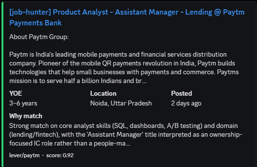
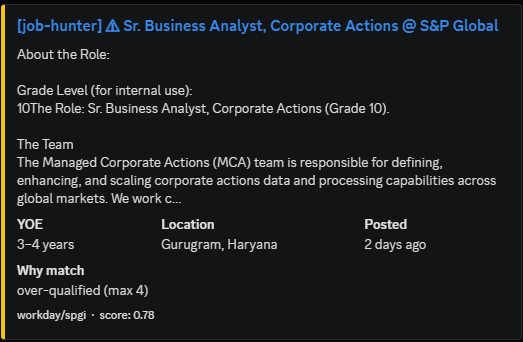
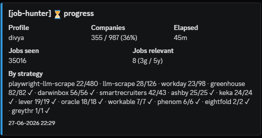
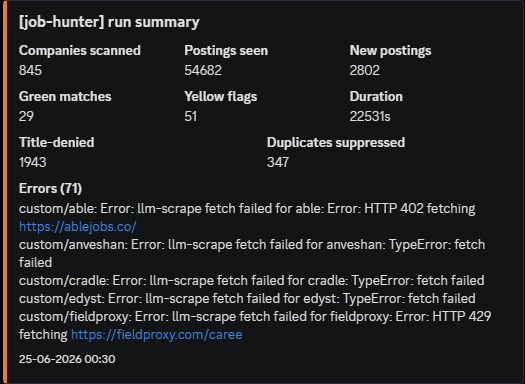

# job-hunter-bot

A personal job-hunting bot. It pulls postings from a list of companies you care about,
filters them against your resume and deal-breakers, and pings the good matches to a
Discord channel.

You run it by hand with `npm run once` whenever you want a sweep. A full sweep over the
~1,300-company registry takes several hours - most of it waiting on the local LLM and on
slow JavaScript-rendered careers pages. Incremental runs (most postings already seen and
deduped from earlier runs) finish much faster.

## What it looks like

Matches arrive in Discord as embeds, color-coded by confidence: green for a strong
match, yellow for borderline (here, slightly over the years-of-experience cap). Each
card shows the role, location, YOE, a one-line "why it matched", and the relevance score.

| Strong match (green) | Borderline (yellow) |
|---|---|
|  |  |

While a run is in flight, an optional progress heartbeat posts every 15 minutes to a
separate channel: how far along it is, jobs seen and relevant so far, and a per-strategy
breakdown.



At the end of every run it posts a single summary embed (companies scanned, postings
seen, green/yellow counts, duration, and any errors) with the matches CSV attached:



## What it needs

- Node 22 or newer (uses the built-in `node:sqlite`).
- [Ollama](https://ollama.com) running locally with a chat model pulled. The default is
  `qwen3.5:9b` (Q4_K_M, about 6.6 GB):
  ```
  ollama pull qwen3.5:9b
  ```
  On an 8 GB GPU it fits with a little CPU offload. Set `OLLAMA_FLASH_ATTENTION=1` and
  `OLLAMA_KV_CACHE_TYPE=q8_0` in Ollama's environment so the KV cache stays small. To
  use a different model, set `OLLAMA_MODEL` (and `OLLAMA_NUM_CTX` for the context size).
- Your resume as a PDF at `config/resume.pdf` (see Getting started).
- A Discord webhook URL (Channel settings, Integrations, Webhooks, New Webhook).
- Optionally, a second Discord webhook (`DISCORD_PROGRESS_WEBHOOK_URL`) for mid-run
  progress heartbeats, posted every 15 minutes while a run is in flight. Leave unset to
  skip (progress is logged instead).
- Optionally, a [Brave Search](https://brave.com/search/api/) API key, used only by the
  discovery flow that finds new companies. The free tier covers it.

## Getting started

```
git clone <your-fork>
cd job-hunter-bot
npm install

cp config/profile.example.ts config/profile.ts
cp .env.example .env
```

Three things to set up:

1. **Resume.** Put your resume PDF at `config/resume.pdf`. On the first run it is
   extracted once to `config/resume.txt`, the plain text the relevance LLM judges
   against. If neither file exists the bot stops with an error, because there is
   nothing to match postings on. After you update the PDF, run `npm run extract-resume`
   to regenerate the text.
2. **Profile.** Open `config/profile.ts` and fill in your target roles, cities,
   deal-breakers, and denylists. Every field has a comment explaining what it is for.
   The shipped example is tuned for a data-analyst search in India; overwrite it.
3. **Discord.** Put your webhook URL into `.env` under `DISCORD_WEBHOOK_URL`. That is
   the only required env var; everything else has a sensible default.

`config/profile.ts`, `config/resume.pdf`, `config/resume.txt`, and `.env` are all
gitignored, so they stay on your machine.

**Multiple profiles.** To run more than one search (e.g. two people, or two role
families), put each under `config/profiles/<name>/profile.ts` with its own `resume.pdf`,
and run `npm run once -- --profile <name>`. Each profile can set its own `webhookUrl`
and even its own relevance-gate prompt (`gatePrompt`); postings and runs are stamped
per profile in the DB. Without `--profile`, the bot uses `config/profile.ts` (the
"default" profile). The whole `config/profiles/` tree is gitignored.

## Commands

| | |
|---|---|
| `npm run once` | The main thing. One full sweep: fetch postings, filter, notify Discord, post an end-of-run report + CSV. Add `-- --profile <name>` for a named profile. Does **not** run discovery. |
| `npm run discover` | Discovery only - a separate step. Pulls candidate companies from YC, RSS funding feeds, and Brave Search; does not touch postings. |
| `npm run extract-resume` | Re-extract `config/resume.pdf` into `config/resume.txt`. Run it after the PDF changes. |
| `npm run probe -- acme swiggy` | Looks up which ATS (if any) a company is on. Useful before adding entries to the registry. |
| `npm run verify` | Checks every entry in your registry is still reachable. Pass `--suggest` to re-probe failed entries against other ATSes. |
| `npm run scrape -- <slug>` | Walks one company through the llm-scrape pipeline so you can see what cheerio finds and what the LLM picks. |
| `npm run repair-urls` | Previews URL repair fixes for companies whose last fetch failed with a 404 or DNS error. Reports proposed fixes only; apply them by hand in the Companies tab. |
| `npm run eval` | Replays a labelled eval dataset through the gate and prints accuracy stats. |
| `npm run lint` | `eslint .` |
| `npm run typecheck` | `tsc --noEmit`. |

## How a posting moves through

The adapter layer does the fetching. Greenhouse, Lever, and Ashby return everything
(including JD bodies) in one request. Workday, SmartRecruiters, and the other API
providers return a listing first; the JD body comes from a second request, made only
for postings worth keeping. For companies that do not use a known ATS, the bot falls
back to a cheerio scrape of the careers page, and if cheerio sees too few links to
make sense of, a Playwright variant renders the page in headless Chromium and tries
again.

Each posting then runs a short gauntlet. Location filter first: if the posting's
location is not in your `targetCities`, country hints, or accepted-remote strings, it
is dropped without an LLM call. SQLite dedup next, keyed on `(provider, externalId)`.
Then a cheap regex on the title to skip postings obviously outside your target role
family (this is what `titleDenyPatterns` in your profile is for; it saves a slow LLM
call per drop).

Anything that survives gets a JD fetch (if the listing did not already include one),
then two LLM calls: a "gate" that returns a `matchScore` plus any deal-breaker hit,
and an "extract" that pulls minimum and maximum YOE from the JD text. The gate judges
the posting against your full resume text. The verdict is tri-state: green if the
score clears your threshold with no soft hits, yellow for borderline matches or soft
hits or unknown YOE, silent for hard deal-breakers and noise. Green and yellow both go
to Discord with different sidebar colors. Silent drops are still logged to the SQLite
DB so you can audit later. A profile can also set `neverSilenceTitlePatterns` - titles
that are floored to yellow instead of silenced even at a low score (for a rare
sub-specialty worth eyeballing), unless they hit a hard deal-breaker or the YOE cap.

Every run ends with a single Discord message: a "run complete" embed (companies
scanned, postings seen, new postings, green/yellow counts, duration, and any errors)
with `searched-<date>.csv` attached. That CSV has one row per matched posting (job
title, link, score, green/yellow tier, reason) followed by one row per company that
errored, is stuck on `manual`, or looks like a silently-failing scrape (a fragile
scraper that returned zero) - each with the reason to fix.

While a run is in flight, a progress heartbeat is posted every 15 minutes to the
separate `DISCORD_PROGRESS_WEBHOOK_URL` channel (companies scanned out of total, jobs
seen, jobs relevant, and a per-strategy breakdown) so you can watch a long run without
tailing logs.

## The registry and adding a company

The company registry is the Companies tab of your outreach Google Sheet. It is the one
source of truth; the bot syncs it into the SQLite `companies` table on each run, and
discovery writes new entries back to it. `data/registry-cache.json` is a bot-maintained
local snapshot of the tab, used only as an offline fallback when the sheet is
unreachable - it is not itself a source of truth, and it is not git-tracked. An ATS
entry's columns look like (see `src/registry/sheet-codec.ts` for the exact column order):

| name | careers_url | source | source_slug | parsing_strategy |
|---|---|---|---|---|
| Acme | https://acme.example.com/careers | greenhouse | acme | ats-api |

Before adding, run `npm run probe -- acme` to find out which ATS hosts their board, and
check the tab first - the company may already be present under a non-obvious slug. If
none of the supported ATSes match, set `source` to `custom` and `parsing_strategy` to
`llm-scrape`. If the careers page is a JavaScript-rendered SPA, use
`playwright-llm-scrape` instead.

Workday entries need one extra column, the tenant URL:

```
tenant_url: https://acme.wd1.myworkdayjobs.com/External
```

Workday has no directory of tenants, so finding these means hunting around the
company's careers page until you spot a `myworkdayjobs.com` link.

## Project layout

```
config/
  profile.ts             your deal-breakers + filters + locations    (gitignored)
  profile.example.ts     template; loader falls back to it
  profiles/<name>/       named profiles (profile.ts + resume.pdf)     (gitignored)
  resume.pdf             your resume PDF                             (gitignored)
  resume.txt             extracted resume text the gate judges on    (gitignored)
data/                    SQLite DB, registry-cache.json, other caches (gitignored)
eval/                    offline gate-replay harness (replay.ts, dataset, metrics)
scripts/                 ops/maintenance CLIs: slug-probe, verify-registry,
                           scrape-probe, repair-urls-tool, url-repair
src/
  ats/                   one file per ATS provider; registry.ts maps provider names
                           to adapters; workday-facet.ts for faceted Workday search
  db/                    per-table modules (companies, postings, runs, quota, ...)
                           behind a barrel index.ts
  discovery/             YC + RSS + Brave sources; ats-patterns + ats-validate;
                           registry-writer.ts writes new entries to the Companies tab
  filter/                location / title / denylist / verdict
  llm/                   Ollama client; prompts/ holds gate.ts, extract.ts, shortlist.ts
  discord/               webhook helper + match/summary notifier + progress heartbeat + CSV uploader
  reports/               end-of-run report + CSV builder
  registry/              sheet-registry.ts syncs the Companies tab (with a
                           registry-cache.json fallback) into the companies table;
                           sheet-codec.ts converts between tab rows and RegistryEntry
  scraper/               cheerio + Playwright LLM fetchers for non-ATS careers pages
  util/                  shared helpers: semaphore, user-agent, slug, json, registry-file
  tools/
    extract-resume.ts    PDF-to-text extraction (run via npm run extract-resume)
  pipeline/              run lifecycle (index.ts), scheduler.ts, posting-pipeline.ts
  config.ts              tunable knobs (workers, LLM model, discovery settings, ...)
  types.ts               shared TypeScript types
  schemas.ts             zod schemas (providers, registry entry, user profile)
  profile.ts             loads the selected profile and attaches resume text
  logger.ts              pino logger setup
  index.ts               CLI entry point
```

## Writing a new ATS adapter

Look at `src/ats/types.ts` for the interface and `src/ats/greenhouse.ts` for the
simplest existing example. The contract:

- `listPostings(company)` is mandatory. Return one `NormalizedPosting` per role. Each
  needs a stable `externalId` (used for dedup) and ideally a `location` string.
- `fetchJd(company, posting)` is optional. Implement it if the listing endpoint does
  not include the JD body. The pipeline only calls it for postings that survived the
  location filter and dedup, so you only pay the HTTP cost for postings you would keep.

After writing the adapter:

1. Register it in `src/ats/registry.ts` under `ATS_ADAPTERS`.
2. Add the provider name to the `ProviderSchema` zod enum in `src/schemas.ts` - the
   `Provider` type is inferred from it, so that one edit covers both the type and the
   runtime validation the registry loader runs.

The supported providers today: greenhouse, lever, ashby, smartrecruiters, workday,
workable, oracle, keka, eightfold, phenom, darwinbox, greythr (plus `custom` for
llm-scrape / playwright-llm-scrape).

## A few things to know

The discovery flow is India-biased out of the box. The YC source filters to India, the
RSS feeds are Indian publications (Inc42, YourStory), and the Brave query pool is full
of India city names. If you are hunting somewhere else, edit `src/config.ts` under
`discovery`.

The bot creates `data/job_hunter.db` on the first run. SQLite WAL files live there too.
The `data/` directory is gitignored entirely.

The LLM gate and extract calls go through a semaphore (capped at one concurrent
generation by default) because Ollama serializes on the GPU anyway. HTTP work inside
one company fans out across `fetch.workersPerCompany` workers. If you run multiple
Ollama instances behind a load balancer, raise `llm.maxConcurrent` in `src/config.ts`.

If a careers page is bot-blocked (Cloudflare, Akamai, and the like), the bot does not
work around it; there is no headless-evasion code. The `manual` parsing strategy exists
for these. Entries marked manual stay in your registry but are never fetched, and they
surface as company rows in the daily `searched` CSV for hand-review.

## License

This project is licensed under the MIT License. See the [LICENSE](LICENSE) file for details.
